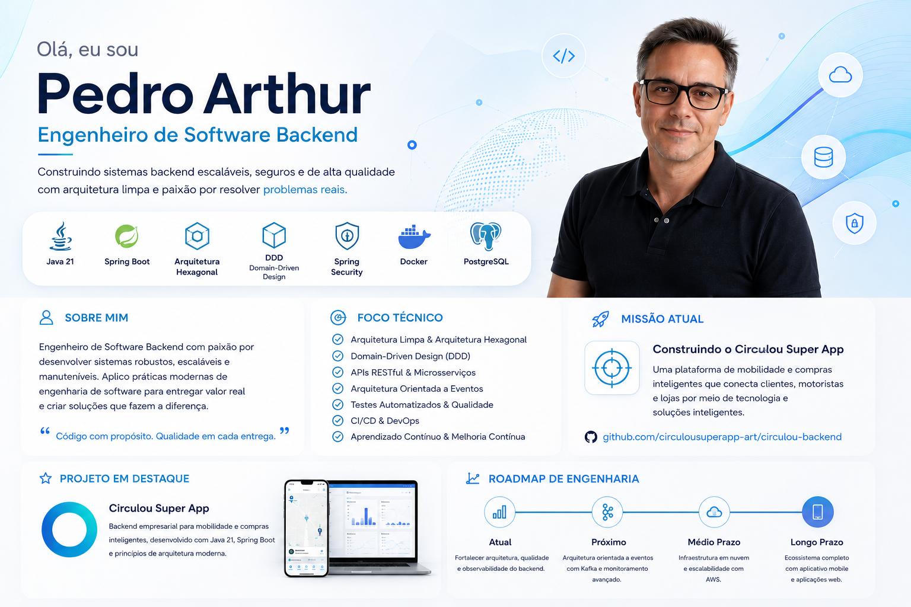

  

# 👨‍💻 My Journey into Software Engineering

## Building a Real Product While Becoming a Better Engineer

My transition into Software Engineering has been driven by a simple belief: the best way to become a better engineer is by building real software.

Alongside my Bachelor's degree in Information Technology Management, I have been designing and developing **Circulou Super App**—a long-term software engineering project where I apply modern architecture, production-ready development practices and product engineering principles.

Instead of waiting for experience alone to shape my career, I chose to create my own environment for learning by solving real engineering challenges.

Circulou became that environment.

Every feature I design, every architectural decision I make and every technology I adopt contributes not only to the evolution of the product, but also to my own growth as a software engineer.

---

# 🌱 Continuous Growth

I believe the fastest way to become a better software engineer is by building real software and continuously learning from every challenge.

Outside my academic studies, I dedicate a significant part of my time to expanding both my technical knowledge and practical experience through the continuous development of Circulou.

## Current Areas of Focus

- Java 21
- Spring Boot
- Spring Security & JWT
- REST API Development
- Hexagonal Architecture
- Clean Architecture
- Domain-Driven Design (DDD)
- PostgreSQL
- Docker & Docker Compose
- GitHub Actions (CI/CD)
- Automated Testing (JUnit, Mockito & Testcontainers)
- Software Design
- AWS Cloud Fundamentals
- Modern Frontend Development
- Advanced Technical English

Alongside this journey, I also have the opportunity to observe experienced software engineers working in real-world environments—from Scrum ceremonies and architectural discussions to collaborative problem-solving and software development.

These experiences help me connect theory with professional practice, while Circulou allows me to immediately apply those lessons through hands-on implementation.

My long-term goal is to become a versatile Software Engineer capable of contributing across the entire software development lifecycle while maintaining a strong specialization in backend engineering, software architecture and distributed systems.

---

# 🚀 Why Circulou?

Circulou has been evolving as a product since around 2018–2019.

Like many successful software products, its journey began long before the first line of code.

It started by identifying a real-world problem, validating business opportunities and designing user experiences capable of making everyday shopping faster, smarter and more sustainable.

The first product concepts and user flows were created in Figma, where the initial vision gradually took shape.

As the project evolved, business and regulatory challenges temporarily paused its development, allowing the idea to mature before returning with a much stronger technical foundation.

Today, Circulou is much more than a portfolio project.

It has become my software engineering laboratory—a place where I continuously learn, experiment and apply modern engineering practices while building a product designed to solve a real-world problem.

Working on Circulou allows me to experience the complete software development lifecycle, including:

- Product Discovery
- Product Design
- Software Architecture
- Backend Development
- Frontend Development
- Database Design
- Automated Testing
- CI/CD
- Technical Documentation
- Continuous Improvement

Throughout this journey, I'm constantly expanding my knowledge in areas such as:

- Enterprise Backend Development
- Marketplace Platforms
- Mobility Solutions
- Product Engineering
- Cloud-Native Applications
- Event-Driven Architecture
- Distributed Systems
- Software Quality
- DevOps Practices

Every feature improves the product.

Every architectural decision strengthens my engineering mindset.

Every iteration is another opportunity to learn.

My goal is not simply to build software.

My goal is to build products that solve real problems while continuously evolving as a software engineer.

---

  

# 👨‍💻 Minha Jornada na Engenharia de Software

## Construindo um Produto Real Enquanto Me Torno um Engenheiro Melhor

Minha transição para a Engenharia de Software sempre foi guiada por uma convicção simples: a melhor forma de evoluir como engenheiro é construindo software real.

Enquanto curso a graduação em Gestão da Tecnologia da Informação, venho projetando e desenvolvendo o **Circulou Super App** — um projeto de engenharia de software de longo prazo onde aplico arquitetura moderna, práticas de desenvolvimento preparadas para produção e princípios de engenharia de produtos.

Em vez de esperar que apenas a experiência profissional moldasse minha carreira, decidi criar meu próprio ambiente de aprendizado resolvendo desafios reais de engenharia.

O Circulou tornou-se esse ambiente.

Cada funcionalidade desenvolvida, cada decisão arquitetural e cada tecnologia adotada contribuem não apenas para a evolução do produto, mas também para o meu crescimento como engenheiro de software.

---

# 🌱 Evolução Contínua

Acredito que a maneira mais rápida de evoluir como engenheiro de software é construir software real e aprender continuamente com cada desafio.

Além da graduação, dedico uma parte significativa do meu tempo ao desenvolvimento contínuo do Circulou, expandindo tanto meu conhecimento técnico quanto minha experiência prática.

## Principais Áreas de Estudo

- Java 21
- Spring Boot
- Spring Security & JWT
- Desenvolvimento de APIs REST
- Arquitetura Hexagonal
- Clean Architecture
- Domain-Driven Design (DDD)
- PostgreSQL
- Docker & Docker Compose
- GitHub Actions (CI/CD)
- Testes Automatizados (JUnit, Mockito e Testcontainers)
- Software Design
- Fundamentos de AWS
- Desenvolvimento Front-end Moderno
- Inglês Técnico Avançado

Durante essa jornada, também tenho a oportunidade de acompanhar engenheiros de software experientes atuando em ambientes corporativos, participando de cerimônias Scrum, discussões arquiteturais, sessões de resolução de problemas e desenvolvimento colaborativo.

Essas experiências me ajudam a conectar teoria e prática, enquanto o Circulou me permite aplicar imediatamente esse aprendizado por meio de implementações reais.

Meu objetivo de longo prazo é tornar-me um Engenheiro de Software versátil, capaz de contribuir em todo o ciclo de desenvolvimento de software, mantendo uma forte especialização em desenvolvimento backend, arquitetura de software e sistemas distribuídos.

---

# 🚀 Por que o Circulou?

O Circulou vem sendo desenvolvido como produto desde aproximadamente 2018–2019.

Como acontece com muitos produtos de software bem-sucedidos, sua história começou muito antes da primeira linha de código.

Tudo começou com a identificação de um problema real, a validação de oportunidades de negócio e o desenho de uma experiência capaz de tornar as compras do dia a dia mais rápidas, inteligentes e sustentáveis.

Os primeiros conceitos do produto e os fluxos de navegação foram criados no Figma, onde a visão inicial começou a ganhar forma.

Ao longo da evolução do projeto, desafios regulatórios e de negócio fizeram com que seu desenvolvimento fosse temporariamente pausado, permitindo que a ideia amadurecesse antes de retornar com uma base técnica muito mais sólida.

Hoje, o Circulou é muito mais do que um projeto de portfólio.

Ele se tornou meu laboratório de engenharia de software — um ambiente onde experimento, aprendo e aplico continuamente práticas modernas de desenvolvimento enquanto construo um produto pensado para resolver um problema real.

Trabalhar no Circulou me permite vivenciar todo o ciclo de desenvolvimento de software, incluindo:

- Descoberta do Produto (Product Discovery)
- Design de Produto
- Arquitetura de Software
- Desenvolvimento Backend
- Desenvolvimento Front-end
- Modelagem de Banco de Dados
- Testes Automatizados
- CI/CD
- Documentação Técnica
- Melhoria Contínua

Ao longo dessa jornada, continuo ampliando meus conhecimentos em áreas como:

- Desenvolvimento Backend Corporativo
- Plataformas Marketplace
- Soluções de Mobilidade
- Engenharia de Produtos
- Aplicações Cloud Native
- Arquitetura Orientada a Eventos
- Sistemas Distribuídos
- Qualidade de Software
- Práticas de DevOps

Cada funcionalidade torna o produto melhor.

Cada decisão arquitetural fortalece minha forma de pensar como engenheiro.

Cada Sprint representa uma nova oportunidade de aprendizado.

Meu objetivo não é apenas desenvolver software.

Meu objetivo é construir produtos que resolvam problemas reais enquanto evoluo continuamente como Engenheiro de Software.
